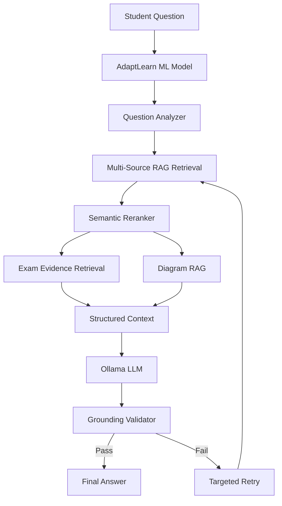

# AdaptLearn

**AI-Powered VTU CSE Educational Assistant**

A grounded hybrid AI educational assistant for VTU CSE students that combines machine-learning-based query understanding, multi-source retrieval-augmented generation, exam-question intelligence, diagram retrieval, and validated LLM generation.

---

## 1. Project Overview

AdaptLearn is an AI-powered academic assistant built specifically for **Visvesvaraya Technological University (VTU) Computer Science and Engineering** students following the **2022 scheme**. It generates structured, exam-ready answers grounded in real academic sources — module notes, textbooks, question banks, previous-year question papers (PYQs), model papers, and labelled diagrams.

Unlike generic AI assistants, AdaptLearn retrieves verified academic content before generating any response, ensuring every answer is traceable to actual syllabus material.

---

## 2. Problem Statement

Generic AI assistants (ChatGPT, Gemini, etc.) produce educationally unreliable answers for VTU exam preparation:

- **Hallucination** — fabricating facts, formulas, or references that do not exist
- **Syllabus mismatch** — answering from a different university's curriculum or outdated editions
- **Poor exam structure** — ignoring VTU-specific marking schemes (2M, 5M, 10M, 15M) and answer depth expectations
- **No VTU grounding** — inability to cite which module, textbook, or previous exam covers a topic
- **Missing exam intelligence** — no awareness of which questions were actually asked in previous VTU exams
- **Unreliable diagrams** — generating incorrect technical diagrams or omitting them entirely

---

## 3. Proposed Solution

AdaptLearn combines multiple AI techniques into a unified pipeline:

```
ML Question Understanding
  + Multi-Source RAG Retrieval
  + Semantic Reranking
  + Exam Evidence Retrieval (PYQ + Model Papers)
  + Diagram Retrieval
  + Ollama LLM Generation
  + Grounding Validation
  = Verified, Exam-Ready Answer
```

---

## 4. Key Innovation

The existing AdaptLearn ML model is used primarily for:

- **Question understanding** — parsing natural-language student queries
- **Topic identification** — resolving subject code, module number, and topic
- **Keyword extraction** — identifying technical terms for retrieval
- **Intent analysis** — detecting question type (definition, explanation, comparison, code, etc.)
- **Marks/depth estimation** — determining expected answer length (2M, 5M, 10M, 15M)

The ML model is **not** the authoritative knowledge source. RAG provides verified academic knowledge from indexed VTU materials.

---

## 5. System Architecture



**Key stages:**

1. **ML Model** — Understands the question, extracts subject/module/topic/marks
2. **Question Analyzer** — Canonicalizes subject codes, detects question types, extracts keywords
3. **Multi-Source RAG** — Retrieves relevant chunks from module notes, textbooks, question banks
4. **Reranker** — Scores and reorders retrieved chunks by relevance
5. **Exam Evidence** — Retrieves matching PYQs and model-paper questions
6. **Diagram RAG** — Finds relevant labelled diagrams or generates structured fallbacks
7. **Ollama LLM** — Generates a structured answer using retrieved context
8. **Grounding Validator** — Verifies the answer against retrieved context; rejects fabricated content
9. **Targeted Retry** — If grounding fails, re-retrieves and regenerates (up to 3 attempts)

---

## 6. Knowledge Sources

AdaptLearn indexes the following VTU CSE academic materials:

| Source Type | Description |
|-------------|-------------|
| **Module Notes** | VTU-aligned notes for each module (1–5) per subject |
| **Textbooks** | Reference textbook content mapped to VTU syllabus |
| **Question Banks** | Solved question-bank answers with model responses |
| **Important Questions** | Curated frequently-asked questions per subject |
| **Previous-Year Question Papers** | Actual VTU exam papers (June/July, Dec/Jan sessions) |
| **Model Question Papers** | Practice papers for exam preparation |
| **Labelled Diagrams** | Technical diagrams with captions and topic tags |
| **Course Outcomes** | VTU course outcome mappings per subject |

**Coverage:** 26 VTU CSE subjects, 125+ modules across semesters 3–7.

---

## 7. Knowledge Hierarchy

```
Core Knowledge
  → Module notes, textbook content

Exam Evidence
  → Question banks, previous-year question papers

Practice Evidence
  → Model question papers, important questions

Visual Knowledge
  → Labelled diagrams with topic mappings
```

---

## 8. ML Model

The AdaptLearn ML model is a fine-tuned LoRA adapter trained on VTU CSE academic content. It assists with query understanding and retrieval — it is **not** treated as an authoritative knowledge source.

The model is served locally via [Ollama](https://ollama.com/) and is used for:

- Subject code resolution (e.g., "normalization" → BCS403)
- Module number detection
- Question type classification (12 types: definition, explanation, comparison, code, etc.)
- Mark estimation (2M, 5M, 10M, 15M)
- Key-point and entity extraction

> **Note:** The ML model's predictions are treated as retrieval guidance. All factual content in the final answer comes from the RAG knowledge base.

---

## 9. RAG Pipeline

```
Student Question
  → Subject / Module / Topic detection
  → Keyword extraction
  → Candidate chunk retrieval (module notes + textbooks + question banks)
  → Semantic + keyword matching
  → Reranking (relevance scoring)
  → Context construction with source attribution
```

The pipeline retrieves and ranks chunks from the indexed knowledge base, constructs a structured context window, and passes it to the LLM for generation.

---

## 10. VTU Answer Generation

Answers are structured according to VTU examination conventions:

- **Marks-aware depth** — 2M answers are concise definitions; 10M answers include definitions, explanations, examples, and diagrams; 15M answers add comparisons and additional analysis
- **Question-type-aware structure** — definitions, explanations, worked examples, comparisons, code with complexity analysis
- **Diagram integration** — relevant diagrams retrieved or structured fallbacks generated
- **Exam relevance** — PYQ and model-paper evidence appended for study context

---

## 11. PYQ & Model Paper Intelligence

AdaptLearn explicitly distinguishes between:

| Type | Meaning |
|------|---------|
| **Previous Year Question (PYQ)** | Actually asked in a VTU examination |
| **Model Question** | Practice/mock paper for preparation |

The system **never** presents model-paper questions as actual historical exams. Each exam question is tagged with its source paper, marks, and module number.

---

## 12. Diagram System

```
Query requires a diagram?
  → Search indexed diagram database by topic tags
  → If found: retrieve source diagram with caption
  → If not found: generate structured Mermaid diagram as fallback
```

Diagrams are served from the indexed `DATA/diagrams/` collection with topic-level mappings defined in `DATA/diagram_topic_map.json`.

---

## 13. Grounding & Validation

Every generated answer passes through a grounding validator before delivery:

```
Generate answer from context
  → Validate against retrieved context
  → Check for generic filler phrases
  → Check for cross-subject contamination
  → Verify topic match and grounding score (≥ 0.25)
  → If PASS: deliver final answer
  → If FAIL: targeted re-retrieval + regeneration
  → Maximum 3 attempts (1 initial + 2 retries)
```

The validator catches:
- Fabricated generic filler phrases
- Cross-domain contamination (e.g., cloud concepts in hardware answers)
- Compiler design answers contaminated with virtualization content
- Insufficient context situations (reported honestly)

---

## 14. Technology Stack

| Layer | Technology |
|-------|-----------|
| **Frontend** | Next.js 15, React 19, Tailwind CSS 4, Framer Motion, Recharts, Mermaid |
| **Backend** | Node.js, Express 4, TypeScript 5 |
| **AI/ML** | AdaptLearn LoRA model (fine-tuned), Ollama (local LLM inference) |
| **RAG** | Custom knowledge base, keyword + semantic retrieval, reranking, grounding validation |
| **Database** | PostgreSQL with Prisma ORM |
| **Real-time** | Socket.IO (WebSocket) |
| **Validation** | Zod schema validation |
| **Security** | Helmet, express-rate-limit, JWT authentication, bcrypt |

---

## 15. Project Structure

```
AdaptLearn/
├── frontend/              # Next.js 15 frontend application
│   ├── src/app/           # App router pages (student + teacher)
│   ├── src/components/    # Reusable React components
│   └── src/lib/           # Utilities and API client
├── backend/               # Express + TypeScript backend
│   ├── src/routes/        # API endpoints (ai, auth, chat, etc.)
│   ├── src/services/      # Core services (RAG, reranker, grounding, etc.)
│   └── prisma/            # Database schema and seed
├── knowledge/             # Processed RAG knowledge base
│   ├── subjects.json      # Subject metadata index
│   ├── knowledge_manifest.json  # Full knowledge manifest
│   └── BCS*/              # Per-subject knowledge (26 subjects)
├── DATA/                  # Source academic materials
│   ├── VTU_CSE_Notes/     # Module notes and question papers (PDFs)
│   ├── VTU_CSE_Textbooks/ # Reference textbooks (PDFs)
│   ├── VTU_CSE_CourseOutcomes/  # Course outcome documents
│   ├── diagrams/          # Labelled diagram images
│   ├── question_papers/   # Archived question papers
│   └── scheme/            # VTU scheme and subject mappings
├── scripts/               # Test and ingestion scripts
│   ├── test_runtime_rag.js        # Phase 3 regression tests (10)
│   ├── test_phase4_pipeline.js    # Phase 4 pipeline tests (57)
│   └── test_final_integration.js  # Final integration tests (10)
├── ml-pipeline/           # ML training pipeline
│   ├── training/          # Training scripts (LoRA fine-tuning)
│   ├── data_gen/          # Dataset generation scripts
│   └── scripts/           # Data processing utilities
├── docs/                  # Project documentation
├── START.bat              # Quick-start script (backend + frontend)
├── TRAIN.bat              # ML training pipeline script
└── .gitignore
```

---

## 16. Setup Instructions

### Prerequisites

- **Node.js** ≥ 18.x
- **PostgreSQL** ≥ 14.x
- **Ollama** — [https://ollama.com/](https://ollama.com/)
- **Python** ≥ 3.10 (for ML pipeline only)

### 1. Clone the Repository

```bash
git clone https://github.com/Rajeshkumar80/Adaptlearn.git
cd Adaptlearn
```

### 2. Backend Setup

```bash
cd backend
npm install
cp .env.example .env
# Edit .env with your PostgreSQL credentials and Ollama settings
npx prisma generate
npx prisma db push
npm run db:seed
```

### 3. Frontend Setup

```bash
cd frontend
npm install
cp .env.example .env.local
```

### 4. Ollama Model Setup

```bash
# Install and start Ollama
ollama serve

# If you have the AdaptLearn GGUF model file:
cd ml-pipeline/gguf-output
ollama create adaptlearn -f Modelfile

# Or use a base model for testing:
ollama pull llama3.1:8b
```

> **Note:** The fine-tuned AdaptLearn GGUF model (~2.9 GB) is not stored in the Git repository due to size. See `ml-pipeline/gguf-output/Modelfile` for the model creation command. The LoRA adapter weights are in `adaptlearn-vtu-lora/`.

### 5. Start the Application

```bash
# Backend (from backend/)
npm run dev

# Frontend (from frontend/)
npm run dev
```

Or use the quick-start script:

```bash
START.bat
```

The frontend runs at `http://localhost:3000` and the backend at `http://localhost:8001`.

---

## 17. Testing

| Test Suite | Tests | Result |
|-----------|-------|--------|
| Phase 3 — Runtime RAG Regression | 10/10 | ✅ PASS |
| Phase 4 — Advanced Pipeline | 57/57 | ✅ PASS |
| Final Integration | 10/10 | ✅ PASS |
| **Total** | **77/77** | **100%** |

| Build | Result |
|-------|--------|
| Backend TypeScript build | ✅ 0 errors |
| Frontend Next.js build | ✅ 0 errors, 19 pages |

Run the test suite:

```bash
node scripts/test_runtime_rag.js
node scripts/test_phase4_pipeline.js
node scripts/test_final_integration.js
```

---

## 18. Example Questions

| Subject | Example Question |
|---------|-----------------|
| BCS302 — Digital Design & Computer Organization | Explain the different addressing modes of 8086 with suitable examples. |
| BCS403 — Database Management Systems | Explain 1NF, 2NF, and 3NF with suitable examples. |
| BCS502 — Computer Networks | Explain the OSI reference model and the functions of each layer. |
| BCS601 — Compiler Design | Explain the phases of a compiler with a neat diagram. |
| BCS701 — IoT & Applications | Explain the architecture of an IoT system with a suitable diagram. |
| BCS304 — Data Structures & Applications | Write a program for BFS traversal and explain its time complexity. |
| BCS303 — Operating Systems | Explain CPU scheduling algorithms with examples. |

---

## 19. Limitations

- Answer quality depends on the completeness and accuracy of the indexed source materials
- Questions outside the indexed VTU 2022 scheme syllabus may return insufficient context
- Diagram retrieval depends on available source diagram assets; fallback diagrams are generated as Mermaid code
- ML predictions are treated as retrieval guidance rather than absolute truth — occasional misclassification is possible
- The system requires Ollama running locally for LLM inference
- Real-time performance depends on Ollama model inference speed and system hardware

---

## 20. Future Work

- Stronger embedding-based semantic retrieval (vector search)
- Improved document OCR for handwritten notes
- Better multimodal retrieval for diagrams and figures
- Larger evaluation benchmark with more subjects and question types
- Improved citation UX showing exact source references
- Automated knowledge base updates for new semesters
- Mobile-responsive student interface improvements

---

## 21. Documentation

Detailed documentation is available in the [`docs/`](docs/) directory:

| Document | Description |
|----------|-------------|
| [FINAL_ADAPTLEARN_ARCHITECTURE.md](docs/FINAL_ADAPTLEARN_ARCHITECTURE.md) | Complete system architecture |
| [FINAL_RAG_PIPELINE.md](docs/FINAL_RAG_PIPELINE.md) | RAG pipeline design and implementation |
| [FINAL_VTU_ANSWER_RULES.md](docs/FINAL_VTU_ANSWER_RULES.md) | VTU answer formatting rules |
| [FINAL_DATA_SOURCES.md](docs/FINAL_DATA_SOURCES.md) | Knowledge source inventory |
| [FINAL_EVALUATION_REPORT.md](docs/FINAL_EVALUATION_REPORT.md) | Test evaluation results |
| [FINAL_DEMO_GUIDE.md](docs/FINAL_DEMO_GUIDE.md) | Live demonstration walkthrough |
| [PROJECT_REPORT.md](docs/PROJECT_REPORT.md) | Academic project report |

---

## License

This project is developed as a major project for VTU CSE academic purposes.
